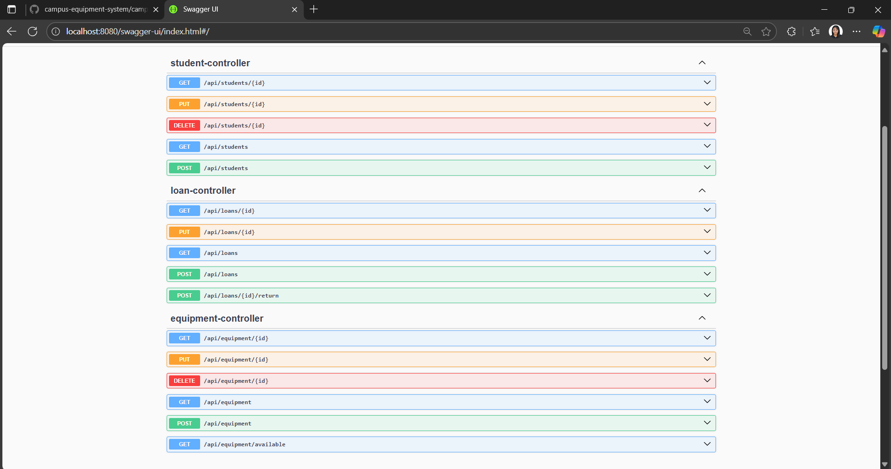
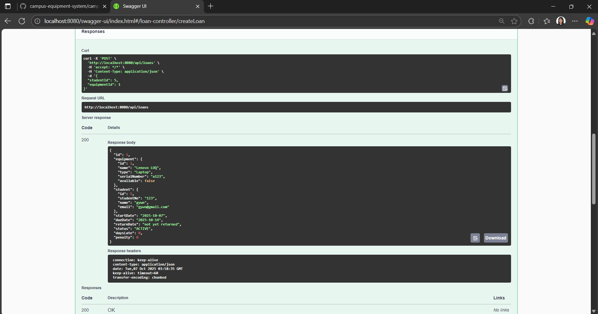
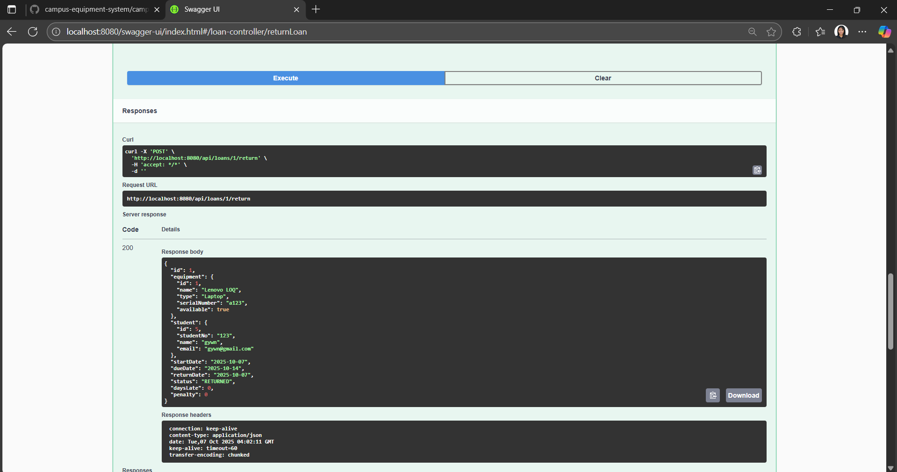
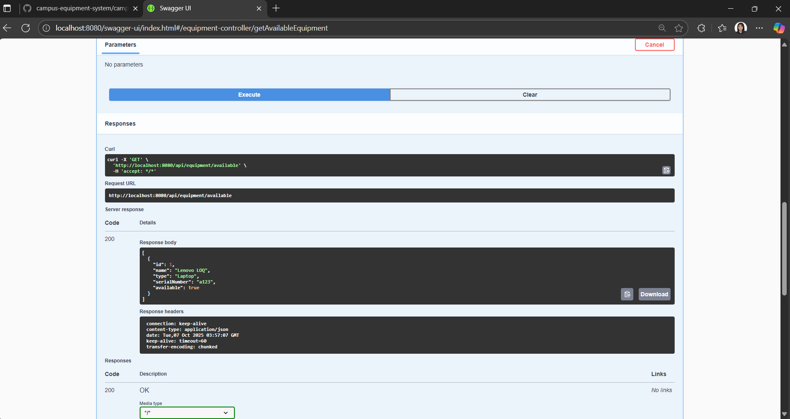

# Campus Equipment Loan System

A Spring Boot mini-application for managing campus equipment borrowing and returns. 

## 🚀 Features
- Manage Students, Equipment, and Loans
- Enforce business rules:
  1. Max 2 active loans per student  
  2. Loan length = 7 days  
  3. Loan is **overdue** if past due date  
  4. ₱50/day late penalty (via Strategy Pattern)  

## 🛠️ Tech Stack
- Java 17+
- Spring Boot 3.x
- Spring Web, JPA, Validation
- H2 (in-memory database)
- Maven (build tool)
- JUnit5 + Mockito (testing)

## 📡 API Endpoints
Equipment API

POST /api/equipment → Create equipment

GET /api/equipment → Get all equipment

GET /api/equipment/available → List available equipment

PUT /api/equipment/{id} → Update equipment

DELETE /api/equipment/{id} → Delete equipment

Loans API

POST /api/loans → Create loan

POST /api/loans/{id}/return → Return loan

GET /api/loans → Get all loans

GET /api/loans/{id} → Get loan by ID

PUT /api/loans/{id} → Update loan

Students API

POST /api/students → Create student

GET /api/students → Get all students

GET /api/students/{id} → Get student by ID

PUT /api/students/{id} → Update student

DELETE /api/students/{id} → Delete student

## ✅ Tests

Business logic covered with JUnit + Mockito:

Borrow equipment (success, equipment unavailable, max active loans exceeded)

Return equipment

Overdue loan detection

Penalty calculation

Fetch available equipment

## Swagger UI screenshots

## Required Endpoints
POST /api/loans → Create a loan

POST /api/loans/{id}/return → Return a loan

GET /api/equipment/available → List available equipment
